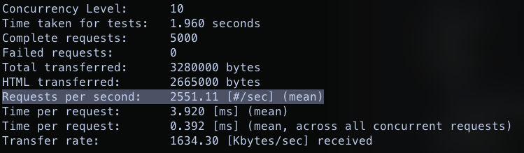

## Prerequisites

Installed Docker Compose

## First installation

Check that ports `8080, 5432, 4222, 8222` are free and run docker compose

```bash
make docker
```

Update DB state

```bash
make migrate
```

Run application

```bash
make run
```

## Apache Benchmark

- Get Order By ID - 2551 RPS   
  NOTICE: replace order_uid in URL on your.

```bash
 ab -n 5000 -c 10 http://0.0.0.0:8080/orders/baf99a3a-1142-4a1d-823f-6882fc71e8d3
 ```



- Create Order - 1854 RPS

```bash
ab -m POST -T application/json -c 10 -n 5000 http://0.0.0.0:8080/orders
```  

